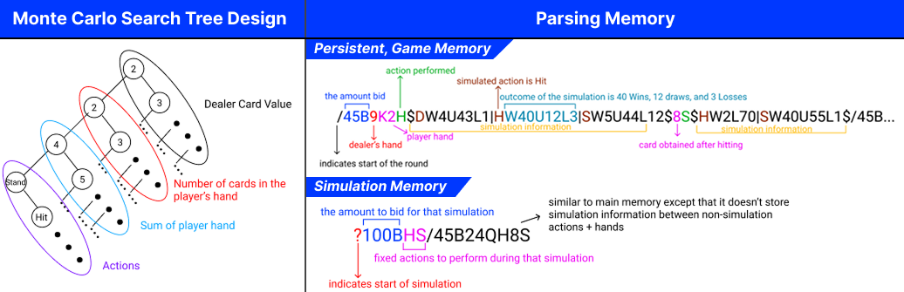
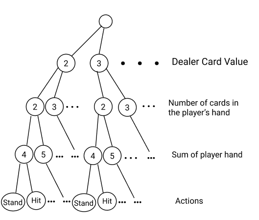
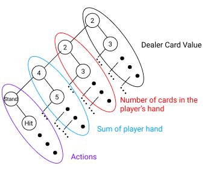
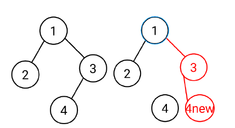
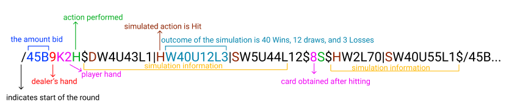
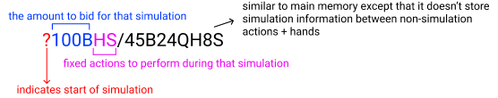
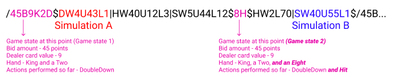

# Black Jack Player

This project creates a bot to strategically play [BlackJack](https://en.wikipedia.org/wiki/Blackjack#Rules_of_play_at_casinos) using the [Monte-Carlo Tree Search (MCTS) algorithm](https://en.wikipedia.org/wiki/Monte_Carlo_tree_search). Written in Haskell.



## Background

I'm sure most people have played this popular game at least once in their lives but if not, the basic premise of the game is that the dealer will deal 2 cards to each player and 1 for themselves, all face up. Each player can decide to *Stand* (keep their current cards) or *Hit* (draw another card), and some other more complex actions. The goal of the player is to obtain a total card value exceeding the dealer's hand but not more than 21. If the player or the dealer gets a total card value exceeding 21, they immediately lose (*bust*).

## Summary
An MCTS algorithm relies on creating a tree of possible states and actions, performing simulations to gauge the outcome probabilities of every (state, action) combination, and selecting the action with the highest probability for a positive outcome.

Due to the constraints in the environment, the search tree does not persist between turns so essentially, on every player turn the search tree is rebuilt. However, this loses out on previous simulation information which forces us to repeat simulations which can take a very long time. Instead, I designed a compact memory storing the current state of the tree (states, actions, wins, losses) which I can parse to rebuild the search tree.

On every turn, the search tree updates the memory to account for recent moves and bids (if bidding turn), otherwise it generates the Monte-Carlo Tree from past memory, chooses the three best actions from this tree and perform multiple simulations to gauge the strength of these actions. Then it chooses the action with the best win rate, updates the memory to include the results of this simulation and finally performs this chosen action.

## Designing a Search Tree in Haskell
To create the search tree, all possible states of the game must be a separate sub-tree. The most straightforward implementation is to represent all states of the same type on the same level. For ex. the first level would be the dealer's possible card values. This creates a k-ary tree where k > 2.



However, since the number of children is inconsistent between nodes, this makes traversal very difficult. So instead, by rotating the tree, we can convert this to a binary tree. This can be done using the left-child right-sibling representation where a node’s first child is reached by following the left pointer and all succeeding children of that node are reached by following the right pointer of this child, i.e. moving down the left subtree is equivalent to going down a level in the k-ary tree. With this method I encoded the various game states in BlackJack like so:



### Simulation
The Monte-Carlo approach hinges on choosing the "best" action given a particular game state and it chooses this best action based on simulation results, however due to time limitations and memory limitations I could not simulate all possible actions because for each action I would perform hundreds of simulations as I needed to find out the estimated strength of an action for as many different possibilities, and store them in memory. Therefore, I needed some metric to be able to choose which actions to simulate, i.e. which actions to explore. I chose to use the UCB formula:

$$\frac{w_i}{n_i} + c \sqrt{\frac{\ln N_i}{n_i}}$$

where
- $w_i$ stands for the number of wins if I perform some action $x$ at a particular game state
- $n_i$ stands for the number of simulations performed for that action $x$ at that particular game state
- $N_i$ stands for the total number of simulations performed for that game state (for all actions)
- $c$ is the exploration parameter $-$ determines how important exploration is

The first component of the formula favours actions that have already been simulated and have the highest win-to-simulation ratio - exploitation, i.e. favours sticking to actions for which we already have an estimate of its strength, the second component of the formula favours actions that have not been explored very much – exploration.

The reason why I used this formula to choose which actions to simulate is because at one end, we would like to further confirm that the current best is truly the best action at that point by running even more simulations for it, while on the other hand we want to explore new possibilities/actions in case those turn out better.

### Traversal
A further challenge was to be able to traverse through a tree, to update its nodes in pure functional programming style. I achieve this using `Zipper`s – a type alias which represents a tuple where the first element is the tree itself and the second element is the `Breadcrumbs` which stores the path taken to reach that node which can then be used to backtrack. This path is a list of information representing all the nodes we have traversed through to reach this particular node. It is important that we store the direction of the path taken, i.e. if we went down the left or the right subtree from the parent node so that we know whether to attach the newly created node to the parents' left or to its right. 

We achieve this with a `Crumb` datatype which can either be a `Left Crumb` or a `Right Crumb` (took left or right subtree to reach that node). For example, in the diagram below, say the root of our tree is the node 1, and say we want to replace node 4. We would need to move right this is done by simply recursing down the right subtree in the `moveRight` function, except that we "remember" where we went, with a `Right Crumb` which stores the node info of the parent (node 1) and its other subtree (which we did not go down into). Then we move left and we "remember" this move by `cons`-ing a `Left Crumb`. 

Now that we've reached the node, we can replace it with a new node and now we use these breadcrumbs to recreate this updated tree. Since the last crumb is a `Left Crumb`, which also stores the parent node information, we can recreate this parent node, 3 and attach the updated node as its left child, then since the next crumb is a `Right Crumb`, we can recreate the parent (root) node and attach the updated node as its right child.



With this structure I can move down to any node in the tree replace it with an updated version and then use the breadcrumbs to rebuild the rest of the tree with this new node replacing the old one. In this way I am able to travel up and down the tree and "modify" nodes in functional programming style using recursion.

Now that we are able to traverse through the tree, we need to be able to locate certain game states. I did this in `findSubTree` which finds the relevant node at each level, then moves left (down a level) from that node and repeats the process until we reach the bottom-most level (action level) if we are finding the subtree which represents a past game state where we already know the action performed, otherwise we stop at the second-last level (dealer card value) if we are finding the subtree which represents the current game state, where we do not yet know what action to perform. With this, to update the number of wins, number of simulations we would simply replace the old node that we have found with the updated one, and when backtracking reattach it to the old tree.

Looking at the UCB statistic, `N_i` requires us to update all the nodes in a particular level. Since our method of updating hinges on the fact that we replace the child of the parent with this new node as we are backtracking, instead of updating the parent, then its child, and so on which would require us to update -> traverse down -> update -> traverse up -> update, which is unnecessarily complex, I instead traverse down to the right most node in that level, update it and update all the parents along the way back up. In this way, the code is very understandable and succinct (`modifyAllInLevel`).

## Memory

### BNF Grammar (terminals are enclosed in quotes)
```
<memory> ::= <simulationInit><roundInit><actions>|<normMem>
<simulationInit> ::= "?"<bid><simActions>
<simActions> ::= <actionType> | <actionType><simActions>
<roundInit> ::= <startOfRound><bid><dealer><hand>
<normMem> ::= <roundInit><body> | <roundInit><body><normMem>
<body> ::= <actions><simulationResult> | <actions><simulationResult><body>
<actions> ::= <actionType> | <card><actionType>
<bid> ::= <number>"B"
<dealer> ::= <digit>
<number> ::= <digit> | <digit><number>
<hand> ::= <card><card>
<simulationResult> ::= "$"<simOutcome>"$"
<simOutcome> ::= <outcome> | <outcome>"|"<simOutcome>
<outcome> ::= <winOutcome><drawOutcome><lossOutcome>
<winOutcome> ::= "W"<number>|""
<drawOutcome> ::= "U"<number>|""
<lossOutcome> ::= "L"<number>|""
<card> ::= <digit>| "A" | "J" | "K" | "Q"
<startOfRound> ::= "/"
<actionType> ::= "H" |"S" | "P" | "I" | "D"
<digit> ::= "0" | "1" | "2" | "3" | "4" | "5" | "6" | "7" | "8" | "9"
```

### Non-Simulation Game Memory


### Simulation Game Memory


The Monte-Carlo Tree Search algorithm requires a lot of information about different actions taken for different game states and their outcomes to reach a decision, since BlackJack is a game broken up into disconnected rounds – nothing except the player’s points are carried forward to the next round, it is possible and highly likely to get a repeated "game state" which refers to the dealer's card + player hand for that round. Therefore, it is important to store as many of these different game states+outcomes as possible so that the tree has an abundance of information to choose an action and as the game progresses, it will slowly improve as more and more simulations are performed and stored.

I had to separate the rounds both to separate the different game states for the Monte-Carlo Tree and to ensure that the bot performs legal actions as some actions are only valid at certain points during a round, such as the beginning of the round. I stored the bid amount so that actions which require it are able to use the correct number of points – for example, to *DoubleDown* you need to put forward the same amount that you bid. Then to encode the dealer and player cards, I had to encode the cards' ranks (Ace as "A", Two as "2", and so on). This is because if I only encoded their value, I would not be able to properly detect when a *Split* was legal or not since all face cards are worth 10 but you cannot split a King and a Queen.

Notice that my memory structure is slightly different for simulations, it has a "?" character in front. The reason for this is so that the `playCard` function can parse it and recognize that it is in a simulation. Once it does, it performs different actions compared to a non-simulated game – instead of looking for the best action for that game state, it will always perform the fixed action because we are interested in how good (or how bad) that action is. To identify these fixed simulated actions, we pass them in together with the "?" before the first round-separator "/". This differentiates them from the other actions performed by the function during the simulation.

### Limitations
A big limitation that I encountered in this process is the memory size which is capped at 10,000 characters. Due to this I had to change the structure of my memory multiple times and to condense as much information as possible. Therefore actions, outcomes, separators are all encoded as single characters. 

This is also the reason why, instead of storing every simulation as its own round with bidding information, dealer card information, and so on, which, for hundreds of simulations would lead to a very long memory, I decided to simply store the single simulated action and the outcome of the simulation. This however introduced another issue, if for example we only know that the simulated action was a hit and that it won that round, this is not very useful information. We don’t know the game state for that action. To solve this issue, instead of treating them like normal rounds, separated by ‘/’, I integrate them within the memory of the current round itself. This works because simulations are set up specifically to mimic the setup of the current round and then to perform some new action and see how the game progresses. 

In this way, I could obtain the game state for that simulation by looking at the game state of the round it is integrated in (expanded upon in Implementation). Additionally, to save even more characters, instead of storing the outcome for each simulation separately – for example, initially I stored outcomes as: "WWLLUWL" and so on, which for hundreds of simulations became quite long, I compiled all the outcomes for all the simulations of the same action, meaning that if I run 500 simulations for hitting at a particular game state, I can encode the outcomes succinctly using a mix of letters and numbers – W340U85L75. It won 340 games, drew 85 games, and lost 75 games.

### Deserialization
to extract and work with data inside contexts then wrap it back into that context after it’s done, for ex. The mcts function is mostly within this do notation as most of the functions it calls are partial functions, thus they return data wrapped in the `Maybe` context).

For parsing, I had to be able to deserialize various symbols into the actual information they represent. Instead of repeatedly performing is char >> pure Item, as taught in the course notes, for each of these character-information pairs, I instead defined the mapping for every non-digit, non-separator symbol used in memory into three lists as a tuple where the first element contains the string representation, and the second element contains the item it represents. Since these lists have similar structures, I used generics for the type alias `Converter` and the function `converterMapping`. With this, I created `convertToPair` and `convertTypeChar`, which operate on tuples to produce a different list of parsers, one for each tuple. 

Now I only have two functions of the form `is char >> pure Item – charConverter`, and `pairConverter`. However, it would be very tedious to always have to map the string input to this list of parsers, instead we can fold over these lists and connect them with the `|||` operator, and now instead of a list of parsers each of which deal with a single character, we have a single parser which can parse any of these characters. In this way, I use small functions to succinctly translate every symbol used in the memory.

I use three main custom datatypes to store information regarding the memory – `History`, `RoundMem` and `SimSetup`. The reason why I decided to store them in these custom datatypes is to improve readability and efficiency of working with the memory information, for example instead of passing in an unnamed integer list, we are able to package all the relevant information into a single datatype with an informative name `–` `RoundMem`. Furthermore, I have defined both datatypes with record syntax because it improves readability as we can give informative names to the data it stores; we can also make use of the generated accessor functions to quickly access the data we are interested in from this type. I use this significantly when working with `RoundMems`. Additionally, I can also use pattern-matching if I want to ensure any of the data fields to have a certain value before performing some action.

When translating a single round’s memory, each of the parsed parts actually form their own `RoundMem`, for example parsing a hit–"H" would create a `RoundMem` with a single action "H", of course for our round we want a singular `RoundMem` to store all this information thus we need some way to combine these `RoundMem`s to a single `RoundMem` which will store all this information. This is made more difficult as `RoundMem` contains data with varying datatypes but is perfect for the Monoid typeclass which defines the aggregation behaviour for a datatype. First, we define the `Semigroup` instance for these custom datatypes, as instances of `Monoid`s must be instances of `Semigroup`. I define the mappend (`<>`) function for these custom datatypes (used to combine `RoundMem`s in line 728), I also define `mempty` to
define a default value for that type which is very useful when paired together with Haskell's type system, which determines the instance of `mempty` to use when it is passed as an argument or when we want to initialize a single data within the datatype`-`for ex, line 748.



One of the toughest challenges I faced while parsing is the recreation of the simulation information. As mentioned above, I only stored the single simulated action and the simulation outcome, therefore, to be able to recreate the game state of the simulation for it to be useable to fill up the MCT, I had to use the non-simulation information that came before it, this is further complicated by the fact that there are multiple non-simulation and simulation sections repeated per round. Referring to the diagram above, I had to make sure that the `RoundMem` for simulation B would contain information about Game state 1+2, it has to jump over all the simulation information (in black) to obtain this information. I solved this issue by combining various parsers, first `parseConfig` parses non-simulation info paired with succeeding simulation info, then in `parseMemAndSim` I use list1 to parse a sequence of this configuration. 

To actually recreate the game state for each simulation, I would need to "accumulate" the information, i.e. simulation A has information about Game state 1 only, but Simulation B has information about both Game state 1 and 2, while also keeping track of the actual hand and actions for that round (otherwise I wouldn’t know what actions were legal at any particular point). Accumulation is typically done using `fold` except that we don’t want to reduce it to a single value, instead we want all "accumulations" along the way, this is why I use scan instead. Since memory is stored left to right, older actions+hands are stored in the beginning therefore I needed to scan from left to right.

### Implementation – Serialization
Serialization of the memory is done mainly by defining the show instance for the custom datatypes that store memory, for example, in OutcomeInfo, and in `RoundMem`. Then encoding the information to memory is as simple as calling show.

### Credit


> Environment setup is written by Tim Dwyer, Arthur Mahéo, Rhys Newbury and Nick Wang

